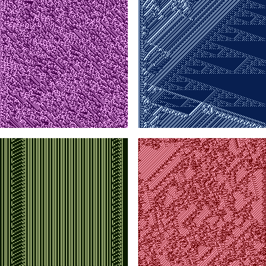

# KeyViz

A simple Discord bot which uses cellular automaton to generate images based on encryption keys

## Commands
 - `!>help` - Provides an overview of these commands within Discord
 - `!>key` - Generates a random encryption key
 - `!>vis [key]` - Generates a an image based on either a random key, or a specified key
 - `!>encrypt (-key [key]) [text]` - Encrypts plain text using either a random key, or a specified key
 - `!>decrypt [key] [text]` - Decrypts encrypted text using either a given key, only the key used to encrypt it can decrypt it

## Some examples of the visualiser

## Other
#### What is it, and how does it work?
This bot was inspired by another one of my projects, which remains hidden, using cellular automaton to produce these pseudo-random images

To explain it as simply as possible, it converts an encryption key into a binary number, and each digit from the binary number, being binary, is either 1 or 0

This is used to create a 'rule'

The rule determines the value of each pixel by comparing it to the value of the pixels before it

If the values of the pixels before it corresponds to a 0 in the rule (don't worry how), then a dark colour is used, otherwise if it corresponds to a 1, a lighter colour is used

The program checks a relativley small number of cells, or pixels, which means that while it may produce some patterns which do not evolve to be pseudo-random, overall, the images produced will be less chaotic, but will not just be noise

#### And finally...
If you're here from [The Coding Academy](abc.xyz 'Not an actual link'), you can invite the bot to test using [this invite link](https://discord.com/api/oauth2/authorize?client_id=819291507881803817&permissions=51200&scope=bot 'Invite KeyViz')
